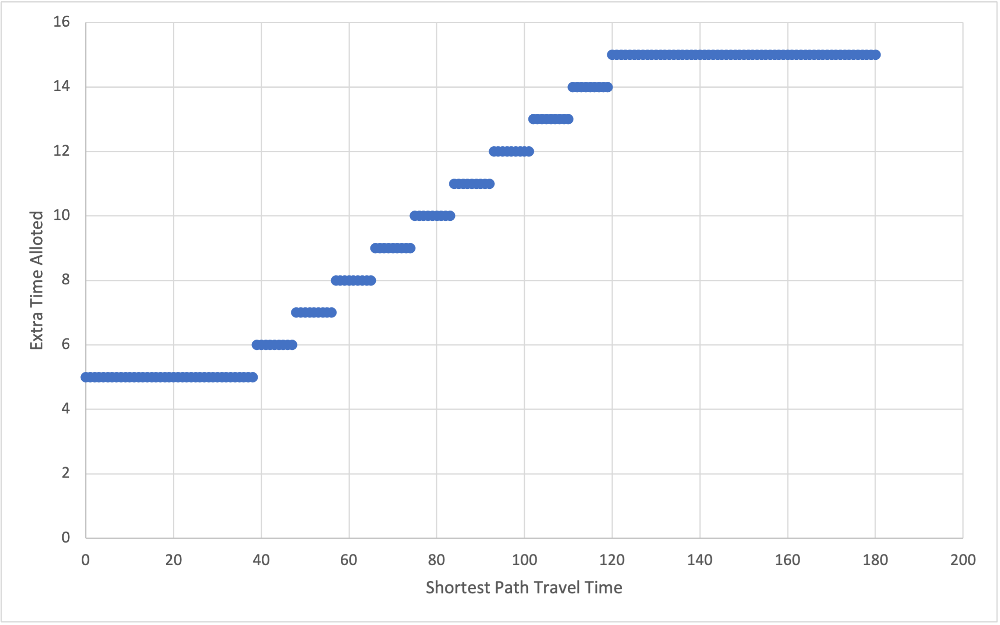

# 2021-12-01

## Number of Paths

* Calculation continues to run, currently finished PM Peak, and part way through AM Peak
* The Calculation is memory intensive due to the number of paths. Some OD pairs result in upwards of 150GB of memory (physical and virtual), and up to 10 million non-unique paths
* Modifications to the code was done due to memory issues, I anticipate the remaining calculations will be faster

* Extra time alloted to the shortest path travel time now varies depending on the original travel time
* Limited by memory - more time alloted means more memory allocated to the code.

### Issue 1

* What should happen if the computer is unable to calculate the path between a specific OD pair?

#### Considerations

* For the 6 departure times, its likely that some of the 6 will successfully compute the number of paths
* If an OD pair can't be calculated, its likely that is has many possible paths.

### Other Points

* I save route combinations, is this useful data?
* Would it be worth to calculate the _number of shortest paths_ to compare with the _number of paths under the threshold_?
    * We may be able to say that a certain group has 3x the number of paths when 15 minutes is added, compared to 5x for the general population
    * Will take ~7 days to fully compute, but less memory intensive than finding the number of paths under the threshold.

## Real Data Case Study

* Will start work on this in parallel while the data is being computed

### General Steps

1. Determine is any new intersections need to be added, and re-snap/re-assign the stops
2. Select dates for AVL data
3. Convert the AVL data to a "GTFS" package
    * Add subway data (or manually add/remove links)
4. Create baseline graph from GTFS
5. Create graph from AVL data
6. Compute measures, and compare to the baseline data

### Questions

* Discussion about using 2016 GTFS to pair with TTS, is it an appropriate assumption to use 2017 GTFS/AVL data if 2016 is not available?
* How far does the WiFi data go back? Does it include all 4 subway lines?
* Besides major subway/streetcar disruptions, how should we determine which dates to use? 
    * Snow, precipitation, streetcar construction, temperature, news?
    * Should we have "control dates"? Dates with no known disruptions? What considerations should we use?
    * How many dates should we analyze? How many from each category?

## Other Items
* TRB Poster
* TRB booking update
* Poster display
* Course auditing questions
* Searching for jobs timeframe, plus companies