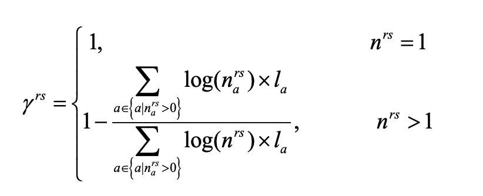
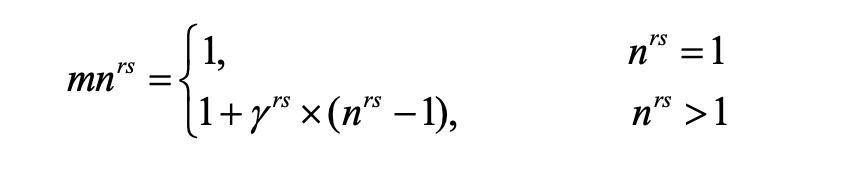
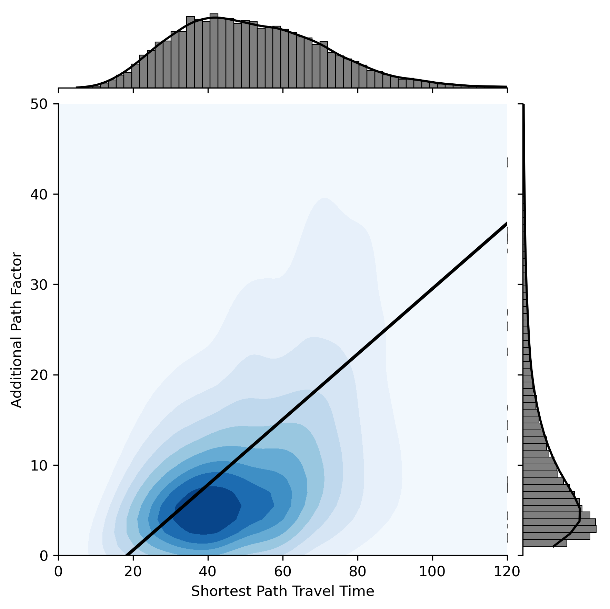
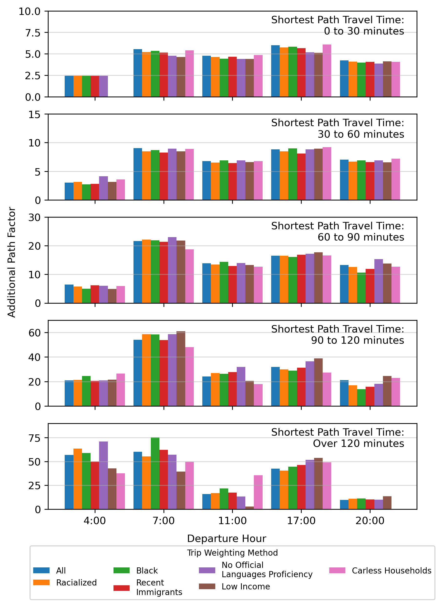
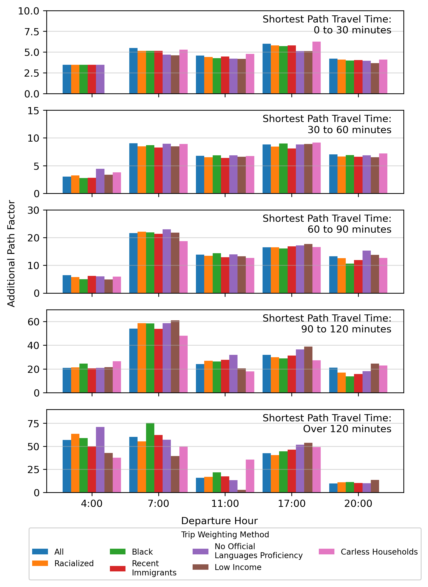

# 2021-12-21

## Updates on Path Counting

* Error was found that undercounted the number of paths
    * The error was found after I initially computed the number of paths for all OD and periods
* Reduced additional time allowance further, since memory requirements are higher due to more paths

```python
if shortest_path_travel_time < 30:
    additional_time = 5
elif shortest_path_travel_time < 120 and shortest_path_travel_time >= 30:
    additional_time = 5 + (shortest_path_travel_time - 30) * 5/90
elif shortest_path_travel_time > 120:
    additional_time = 10

```
|------|------|
| ||





|All ODs and Paths|Exluding Walk ODs and Paths|
|------|------|
|||

