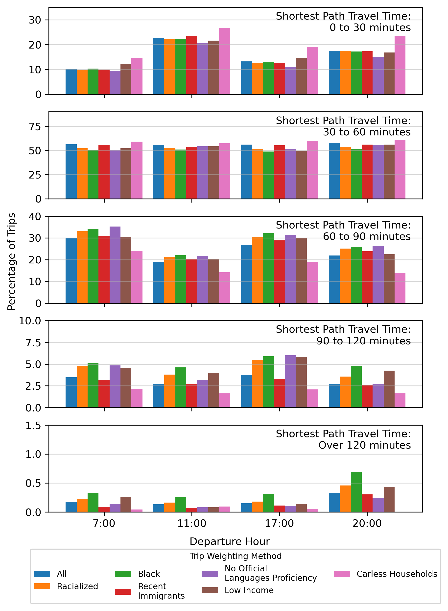
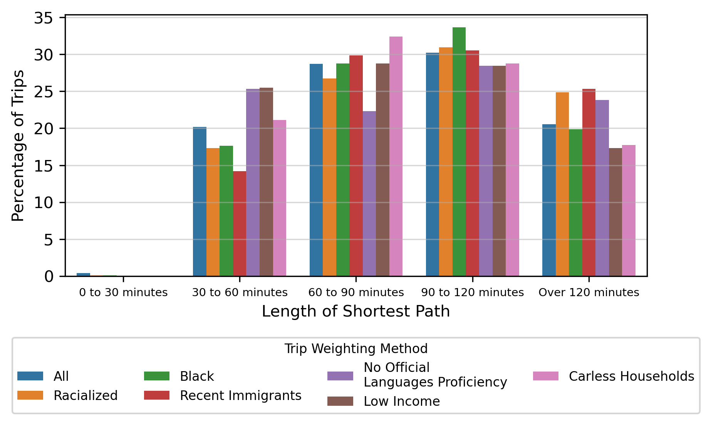
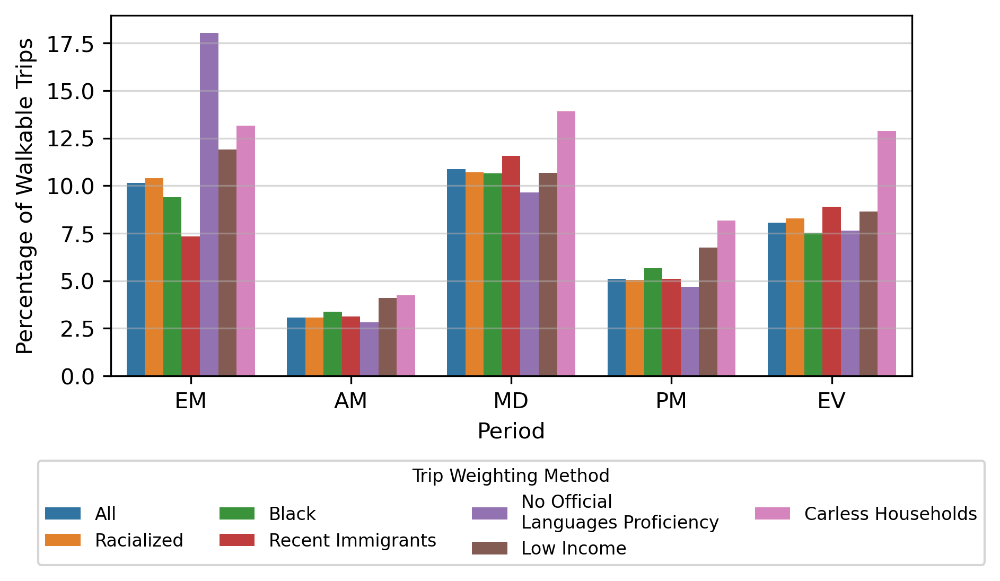
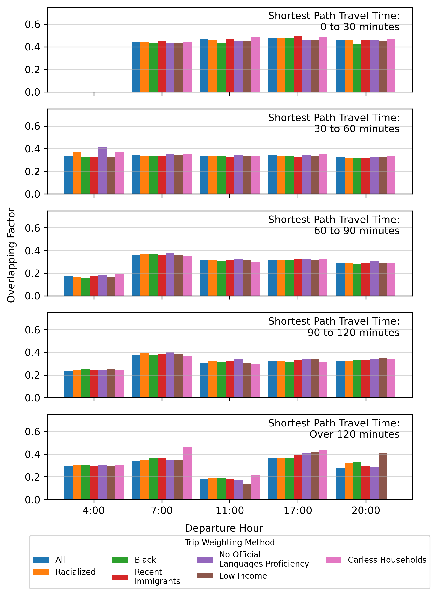

# 2021-12-21

## Updates on Path Counting

* Error was found that undercounted the number of paths
    * The error was found after I initially computed the number of paths for all OD and periods
* Reduced additional time allowance further, since memory requirements are higher due to more paths

```python
if shortest_path_travel_time < 30:
    additional_time = 5
elif shortest_path_travel_time < 120 and shortest_path_travel_time >= 30:
    additional_time = 5 + (shortest_path_travel_time - 30) * 5/90
elif shortest_path_travel_time > 120:
    additional_time = 10

```
|||
|------|------|
| ||

* Additional Path Factor = (Number of Effective Paths)/(Number of Effective Shortest Paths)
* Paths are already cleaned to represent unique interesections (no time or route dimensions)

### Impact of Path Length on Additional Path Factor


* KDE Plot with regression line of all ODs, all Periods, and all Trials
* Establishes need to bin out the results

### Percentage of Trips Belonging to Each Duration Bin, By Group and Period




* Certain equity-seeking groups are more likely to have long trips

### Percentage of Trips where the Shortest Path is a Walking Path



* When trips can be made by walking, the severity of disruption is less for an individual
* Walking calculation is imperfect. The graph does not have a road network, and ODs are from zone centroid to zone centroid. 

### Overlapping Factor, Gamma



### Additional Path Factor

|All ODs and Paths|Exluding Walk ODs and Paths|
|------|------|
|||

* For longer trips, equity-seeking groups are more likely to have additional path options.
* Frequent/direct suburban transit is more available in areas with greater equity-seeking populations

### Real Time Data Updates

* Have not started any work 
* Analysis Period is tentatively set for Nov 2019 - January 2020
* Backfilling update
* Next Train Arrival Data as a backup for the Wifi Data
    * We can potentially shift the analysis period to ensure that bus disruptions are captured

#### Measures

Only measures that can quickly produce results will be analyzed. This is because we are effectively creating 20 graphs

##### Pathfinding Measures
* Global efficiency (Highest Priority), 
    * No link removal, comparing with static/planned service on GTFS, and with normal day
* Importance (Additional Delay Created)

##### Static/Route Map Graph Measures (Lower Priority, may be removed)
* Clustering
* Connectivity
* Cycles

##### Potential Issues
* Missing Trips (Run On Directed Buses)
* In accurate arrival times/locations