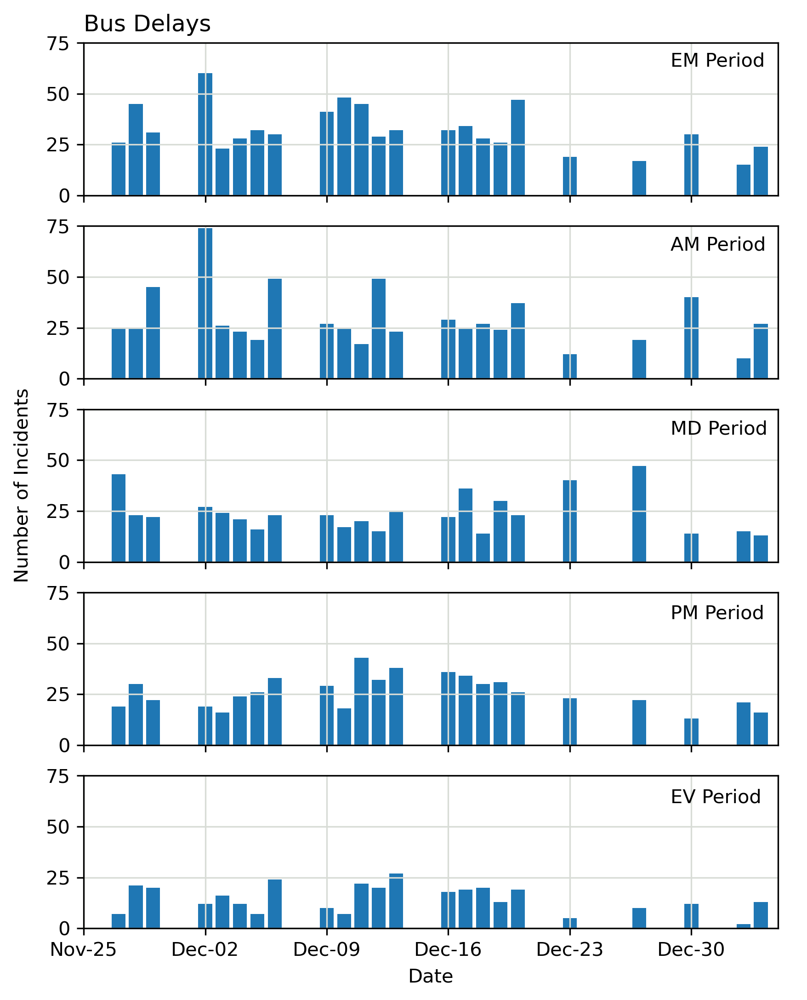
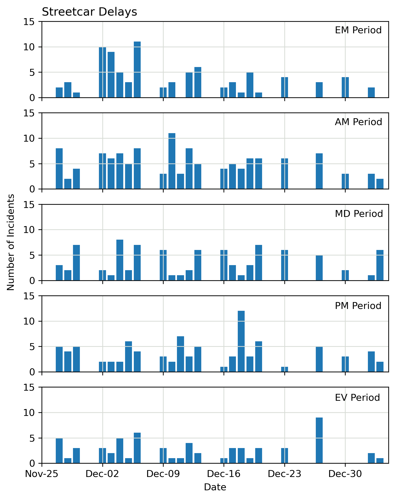
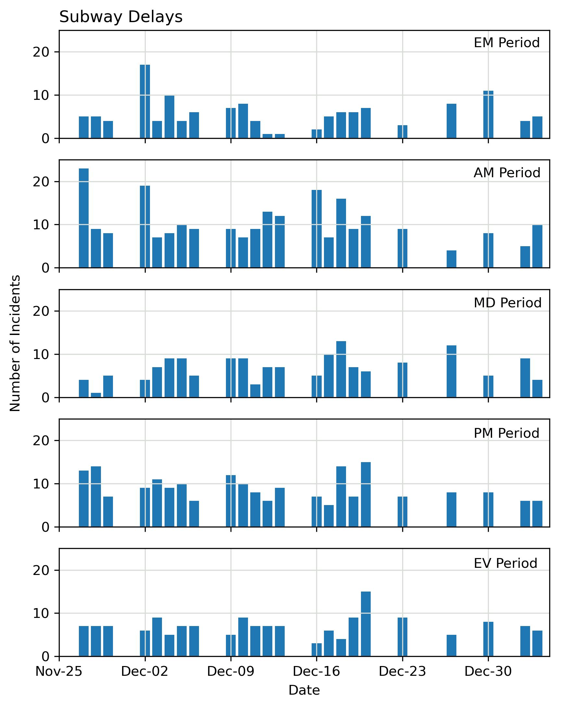
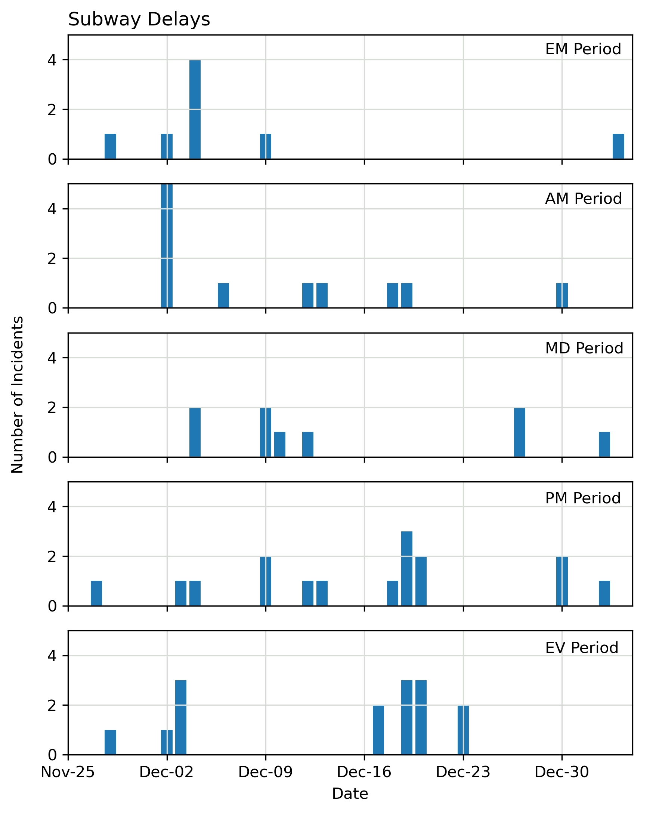

# 2022-01-12

## Choosing Analysis Dates

* Limited to 23 Dates for the Nov 24 GTFS Feed
* Counted number of delays-route-hour combinations to get number of incident per period
    * Limited to delays occuring within first 3 hours of a period
* Chose dates with some level of disruptions among both subway and surface transit network 

## Chosen Dates

* Can't feasibly choose dates where only the bus network is disrupted (and other modes aren't)

### Dates with disruption

| EM         | AM         | MD         | PM         | EV         |
|------------|------------|------------|------------|------------|
| 2019-11-28 |            |            | 2019-11-28 |            |
|            |            |            |            | 2019-11-29 |
| 2019-12-02 | 2019-12-02 |            |            |            |
|            |            | 2019-12-04 |            |            |
|            | 2019-12-06 |            |            | 2019-12-06 |
|            |            | 2019-12-09 |            |            |
| 2019-12-10 |            |            |            |            |
| 2019-12-11 |            |            | 2019-12-11 |            |
|            | 2019-12-12 |            |            |            |
|            |            |            | 2019-12-13 | 2019-12-13 |
|            |            | 2019-12-17 |            | 2019-12-17 |
|            |            |            | 2019-12-18 |            |
|            |            | 2019-12-19 |            |            |
| 2019-12-20 | 2019-12-20 |            | 2019-12-20 | 2019-12-20 |
|            |            | 2019-12-23 |            |            |
|            | 2019-12-30 |            |            |            |

### Dates with no disruption

| EM         | AM         | MD         | PM         | EV         |
|------------|------------|------------|------------|------------|
| 2019-11-27 |            |            |            | 2019-11-27 |
|            | 2019-11-28 | 2019-11-28 |            |            |
|            |            |            | 2019-12-02 |            |
|            | 2019-12-05 |            |            | 2019-12-05 |
|            |            |            |            | 2019-12-09 |
|            | 2019-12-11 | 2019-12-11 |            |            |
|            |            | 2019-12-12 | 2019-12-12 |            |
| 2019-12-23 | 2019-12-23 |            | 2019-12-23 |            |
| 2019-12-27 | 2019-12-27 |            |            |            |
|            |            | 2019-12-30 |            |            |
| 2020-01-02 |            |            | 2020-01-02 | 2020-01-02 |
| 2020-01-03 |            | 2020-01-03 | 2020-01-03 | 2020-01-03 |

### Questions

* Ideal scenario is to analyze all 23 dates, and pick out disrupted/not disrupted based on total travel time delay
* How can we aggregate results when the severity of each delay is different