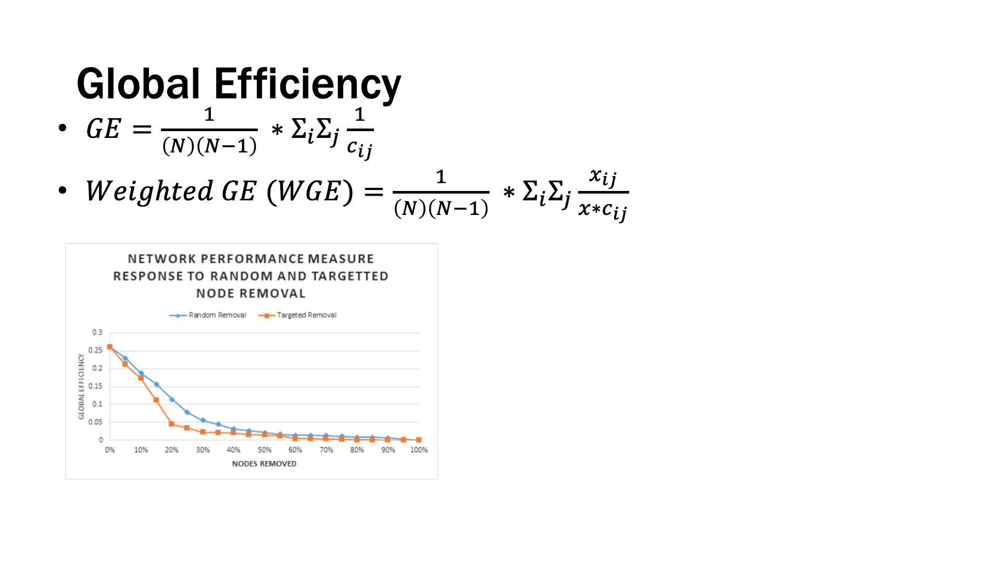
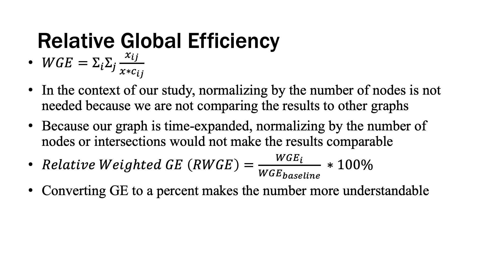
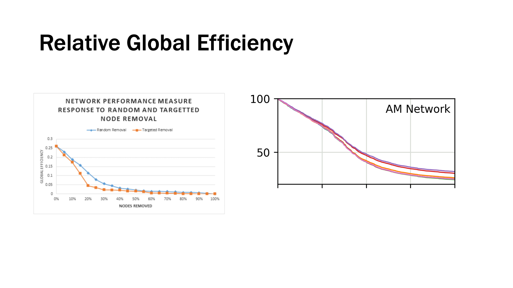
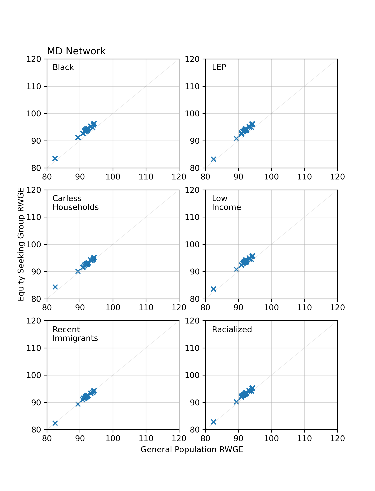
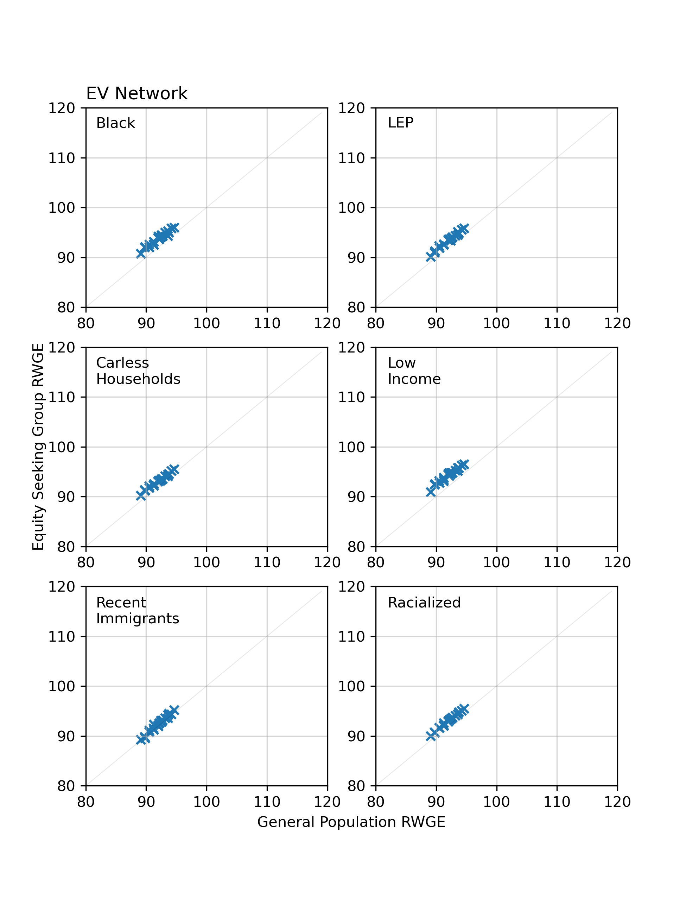
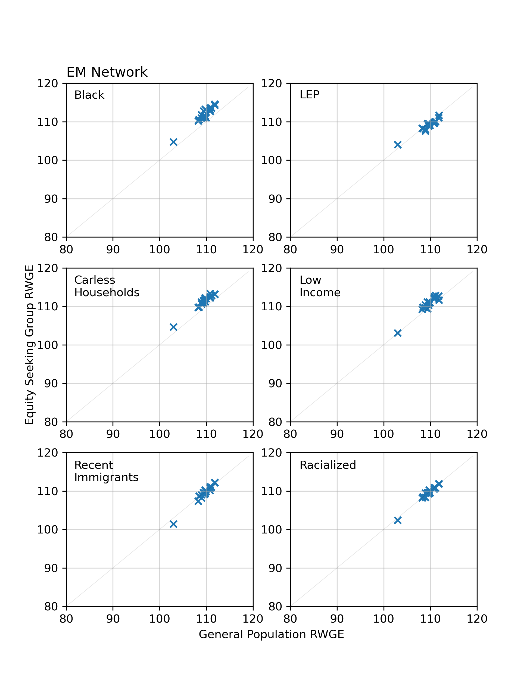
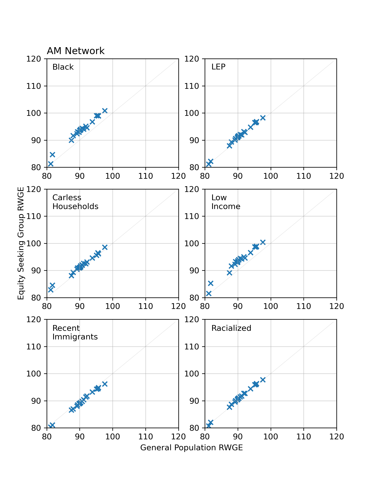
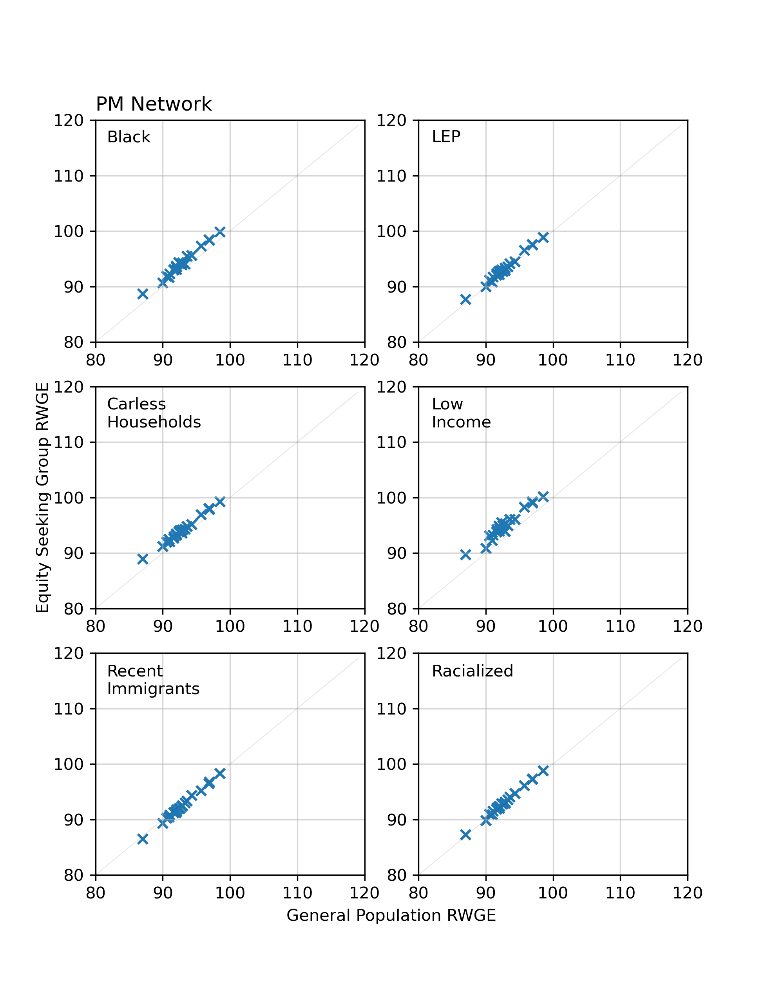

# 2022-03-09

## Relative Weighted Global Efficiency by Equity Group

* Compared the result for each group-day combination to the baseline GTFS-group combination

* In general, there isn't a huge difference in efficiency based on equity group, or length of disruption. In some cases, some equity groups have less disruption than the general population

## What's Next?